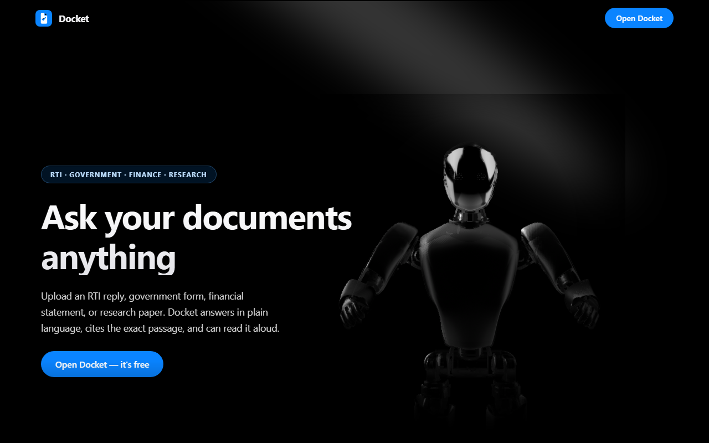
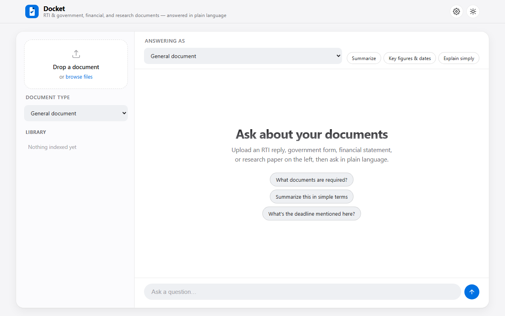

# Docket

> Upload an RTI reply, government form, financial statement, or research paper — then ask questions about it in plain language, with an optional spoken answer for accessibility. Built on [RocketRide](https://rocketride.org), the open-source AI pipeline engine.

Docket's mark is a document with a folded corner and a checkmark — a page you can trust the answer from.

## Screenshots

| | |
|---|---|
|  |  |
| Landing page — dark hero, interactive 3D scene, feature overview | App workspace — upload, library, focus selector, quick actions |
|  |  |
| `ingestion.pipe` in the RocketRide VS Code extension's visual editor | The same pipeline running, with live status and performance metrics |

*(Image files live in `docs/screenshots/` — see that folder if any of the four above aren't rendering.)*

## What it does

People dealing with dense, jargon-heavy, sometimes-scanned documents — RTI (Right to Information) replies and government paperwork, financial statements and filings, or academic/research papers — all face the same problem: the information is in there, but finding and trusting an answer takes real effort. Docket:

1. **Indexes** an uploaded document — OCR for scanned pages (English or Devanagari/Hindi script by default, configurable), PII redaction, chunking, embedding, and storage in Qdrant.
2. **Answers questions** about it via a citation-grounded RAG pipeline, framed for the kind of document it is, and can **read the answer aloud** (text-to-speech) for low-literacy or visually-impaired users.

## Who it's for, and how it adapts

Every document you upload is tagged with a **document type**, and every question is asked with a **focus** — both pick from the same four options, so you can, for example, index a financial filing under "Financial document" and still ask a general question about it with "General document" focus, or vice versa:

| Type | What changes |
|---|---|
| **General document** | Plain grounded Q&A: answer only from the document, say so plainly if it isn't there. |
| **RTI / Government** | Plain-language explanations, jargon spelled out, cites the specific section/clause where possible. |
| **Financial document** | Numeric precision — exact figures, currency, dates, and percentages quoted from the source rather than rounded or estimated; flags missing figures instead of guessing. |
| **Research / academic** | References the specific section/methodology/finding, keeps a precise academic tone instead of a conversational one. |

This is implemented as **per-request instructions** (`rocketride.schema.Question.addInstruction()`), not hard-coded into the pipeline — see [Why categories aren't in the pipeline file](#why-categories-arent-in-the-pipeline-file) below for why that distinction matters.

On top of picking a focus, three **quick actions** are one click away for any document type: **Summarize**, **Key figures & dates** (numbers/deadlines as a structured list), and **Explain simply** (rewritten in plain language, jargon spelled out).

## Features

- **Landing page** built as one continuous canvas rather than a stack of disconnected blocks: a full-bleed dark hero with an interactive 3D scene ([Spline](https://spline.design), cursor-reactive, with an ambient spotlight glow) fades seamlessly into the feature grid and **Contact Us** form below, with a single accent-glow motif carried through every section and a nav bar that turns from transparent to frosted-glass as you scroll past the hero. `/api/contact` persists messages to a local `contact_messages.jsonl` — no email service is wired up, so nothing is actually emailed unless you connect one. "Open Docket" enters the app proper; the choice is remembered so returning visitors skip straight to it, and the top-bar logo takes you back.
- **Document type tagging** on upload (General / RTI-Government / Finance / Research), shown as a colored badge in the **Library** panel.
- **"Answering as" focus selector** + **quick actions** (Summarize, Key figures & dates, Explain simply) in the chat toolbar.
- **Drag-and-drop upload** with a live progress bar, and a **Library** panel listing everything indexed so far.
- **Source citations** — every answer can show the retrieved passage(s) it was grounded in, as expandable animated cards (`response_documents` branch on the `qdrant` search node in `query.pipe`).
- **Listen to the answer** — a compact waveform-style audio player (Kokoro TTS via `audio_tts`) with animated equalizer bars, not just the browser's default audio controls.
- **Settings panel** (gear icon) — add, replace, or remove your RocketRide/Gemini API keys and server URL from the UI, and pick the OCR document language / read-aloud voice, without hand-editing `.env`. Saving writes straight to `.env` and reconnects live; nothing is ever echoed back in full once saved (masked as `••••1234`).
- **Follow-up questions work** — the last several turns are sent as conversation history (`rocketride.schema.QuestionHistory`) with every question, so "what about my case" style follow-ups are grounded in what was already asked.
- **Copy answer**, **clear conversation**, **export conversation** (Markdown download), and starter suggestion chips for first-time users.
- **Light/dark appearance**, toggle in the top bar, persisted across visits, respecting the OS preference on first load.
- Toast notifications for upload success/failure; every error path returns readable JSON instead of a raw stack trace, including when RocketRide itself is unreachable.

The UI is a React + [Framer Motion](https://motion.dev) build (Vite), styled after Apple's native app conventions — system font stack, light/dark tokens, frosted-glass top bar, pill controls — structured as a two-pane app shell (library sidebar + conversation) rather than a single centered chat box. Motion is used deliberately, not decoratively: a page-load reveal (top bar, then workspace, then sidebar), spring-based modal/toast entrances, animated message/citation-card reveals, and an audio waveform that only animates while actually playing.

### The landing page's 3D hero

`frontend/src/components/SplineScene.jsx` + `Spotlight.jsx`, composed directly into `LandingPage.jsx`'s full-bleed dark hero section, adapted from the [Interactive 3D](https://21st.dev/@serafim/components/splite) community component (`@splinetool/react-spline` + an Aceternity-style spotlight glow) into this project's plain-CSS/JS stack — same structure and the same publicly-shared Spline demo scene, restyled with Docket's own tokens instead of Tailwind utility classes, since the codebase doesn't use Tailwind/shadcn/TypeScript elsewhere. The hero itself is deliberately always-dark (independent of the site's light/dark toggle) and blends into the rest of the page via a bottom gradient fade into `var(--bg)`, so it reads as one section rather than a boxed-in card. `frontend/src/motion.js` centralizes the easing curve and reveal-animation timing so the hero, feature cards, contact form, and footer all animate on the same rhythm.

Two things worth knowing if you change or replace it:
- The scene URL (`https://prod.spline.design/kZDDjO5HuC9GJUM2/scene.splinecode`) is a **shared public demo scene**, not something exclusively ours — it's the same one used across many "interactive 3D" templates. Swap it for your own Spline scene URL if you want something exclusive to this project.
- `@splinetool/react-spline` pulls in a large runtime (Spline's 3D engine, ~2MB minified). It's lazy-loaded (`React.lazy`), so it's a separate chunk that only downloads when the landing page's hero actually renders — it doesn't add to the main app bundle.

### Managing API keys from the UI

Open the gear icon in the top bar to:
- Set/replace the **RocketRide API key**, **Gemini API key**, and **RocketRide server URL**.
- **Remove** any key individually (writes a clean `.env` with that line deleted).
- Pick the **OCR document language** and **read-aloud voice** from dropdowns instead of editing `ROCKETRIDE_OCR_PROFILE`/`ROCKETRIDE_TTS_VOICE` by hand.

Saving/removing always persists to `.env` first, then attempts to reconnect so the change takes effect immediately (pipelines substitute `${ROCKETRIDE_*}` variables at start time, so a running pipeline won't pick up a `.env` edit on its own — see `_reconnect()` in `app.py`). If RocketRide isn't reachable yet, the save still succeeds and you'll see a clear notice that the reconnect attempt failed.

**Where does the RocketRide API key come from?** Unlike the Gemini key, there's no signup portal — it's a shared secret you set yourself, matching what your RocketRide server is configured with. A local dev server (`docker compose up`, per [rocketride-server](https://github.com/rocketride-org/rocketride-server)) ships with a built-in default: **`MYAPIKEY`**. If you're pointed at someone else's on-prem/production server, ask them for the key they configured.

## Architecture

Two RocketRide pipelines (`.pipe` files, portable JSON, importable in the RocketRide VS Code extension), a Flask backend, and a React frontend:

```
┌──────────────────────────┐      ┌────────────────────┐      ┌─────────────────────────┐
│  React + Framer Motion   │──────▶      Flask (app.py)  │──────▶  RocketRide pipelines   │
│  (frontend/, Vite build) │ HTTP │  .env / settings /   │  SDK │  ingestion.pipe          │
│                          │◀─────│  question building  │◀─────│  query.pipe              │
└──────────────────────────┘      └────────────────────┘      └─────────────────────────┘
```

### `pipeline/ingestion.pipe` — document indexing

```
webhook → parse ─┬─────────────────────────────┐
                  └→ ocr (scanned pages) ───────┤
                                                 ↓
                                          anonymize_text (PII redaction)
                                                 ↓
                                    preprocessor_langchain (chunking)
                                                 ↓
                                      embedding_transformer (miniLM)
                                                 ↓
                                              qdrant (store)
```

PII redaction runs for every document type, not just government paperwork — financial statements carry account numbers, research papers carry author contact details, and so on.

### `pipeline/query.pipe` — RAG question answering

```
chat → embedding_transformer → qdrant (search) → prompt (baseline grounding instructions)
                                                        ↓
                                                   llm_gemini
                                                    ↓       ↓
                                          response_answers  audio_tts → response_audio
                                        (+ response_documents → "sources" branch off qdrant)
```

### Backend + frontend

- `app.py` — Flask backend. Both pipelines are started **once** at process startup (via the real `rocketride` Python SDK: `RocketRideClient`, `connect()`, `use()`, `chat()`, `send_files()`, `disconnect()`) and reused for every request, matching RocketRide's own guidance against starting a pipeline per-request. Also owns: `.env` read/write for the Settings panel, the document-type/quick-action instruction tables, and the in-memory document library. Serves the built frontend from `frontend/dist/`.
- `frontend/` — React 19 + Vite + Framer Motion. `src/components/` holds one component per UI piece (TopBar, Sidebar, UploadZone, Library, Chat, ChatToolbar, MessageBubble, SourceCard, WaveformPlayer, SettingsModal, ToastStack, Logo, LandingPage, SplineScene, Spotlight, FeatureGrid, ContactSection); `src/api.js` is the thin fetch layer talking to the Flask routes below; `src/motion.js` centralizes the shared animation easing/timing. `App.jsx` toggles between the landing page and the app view (no router — just two components and a bit of state, since there are only two views).

### Why categories aren't in the pipeline file

`pipeline/query.pipe`'s `prompt` node has one fixed set of baseline instructions (grounding: answer only from context, cite what you can, say so if it's not there). Document-type and quick-action instructions are **not** additional static `prompt` nodes or per-category `.pipe` files — they're built per-request in `app.py`'s `_build_question()` using `Question.addInstruction()` / `addHistory()`, and travel through the pipeline as part of the `Question` object the `chat` source ingests.

The alternative — a separate pipeline (or a differently-configured `prompt` node) per document type — would mean restarting/re-selecting a pipeline every time someone changes their answering focus, which conflicts with RocketRide's own "start once, reuse many times" guidance (`ROCKETRIDE_COMMON_MISTAKES.md`, "Starting Pipeline for Every Request") and would make focus-switching feel slow. Per-request instructions get the same effect with one long-lived pipeline.

## Setup

1. **Install RocketRide** (server + Qdrant) per [rocketride-org/rocketride-server](https://github.com/rocketride-org/rocketride-server), or point `.env` at an existing instance.
2. **Copy the env template and fill in real values:**
   ```bash
   cp env.example .env
   ```
   You need: a RocketRide server URI + API key (`MYAPIKEY` for local dev, see above), a Gemini API key ([aistudio.google.com](https://aistudio.google.com)), and a reachable Qdrant instance. All of this can also be set later from the in-app Settings panel instead of hand-editing `.env`.
3. **Install Python dependencies:**
   ```bash
   python -m venv venv
   # Windows: venv\Scripts\activate | macOS/Linux: source venv/bin/activate
   pip install -r requirements.txt
   ```
4. **Build the frontend** (requires Node.js 18+):
   ```bash
   cd frontend
   npm install
   npm run build
   cd ..
   ```
5. **Verify setup:**
   ```bash
   python check.py
   ```
6. **Run:**
   ```bash
   python app.py
   ```
   Open `http://localhost:5000`.

### Frontend development

For active frontend work, run the Vite dev server (hot reload) alongside Flask instead of rebuilding on every change:

```bash
# terminal 1
python app.py
# terminal 2
cd frontend && npm run dev
```

`frontend/vite.config.js` proxies `/api` and `/health` to `http://localhost:5000`, so open `http://localhost:5173` during development. Run `npm run build` again before relying on `python app.py` alone (it serves the built `frontend/dist/`, not the dev server).

## Project structure

```
.
├── app.py                    # Flask backend (real RocketRideClient SDK usage)
├── check.py                  # Setup verification script
├── requirements.txt
├── env.example                # Template for .env (never commit real .env)
├── docs/
│   └── screenshots/            # Images referenced by this README
├── pipeline/
│   ├── ingestion.pipe         # Document indexing pipeline
│   └── query.pipe             # RAG query + TTS pipeline
└── frontend/                  # React + Vite + Framer Motion UI
    ├── index.html
    ├── vite.config.js
    ├── public/favicon.svg      # Docket mark
    └── src/
        ├── main.jsx
        ├── App.jsx
        ├── api.js              # fetch layer for the Flask routes below
        └── components/
```

## API reference (Flask backend)

| Route | Method | Purpose |
|---|---|---|
| `/` | GET | Serves the built frontend |
| `/health` | GET | RocketRide connection status |
| `/api/upload` | POST | Index a document (`file`, `category` form fields) |
| `/api/documents` | GET | List indexed documents (filename, status, category, timestamp) |
| `/api/categories` | GET | Document-type and quick-action labels (single source of truth, consumed by the UI) |
| `/api/query` | POST | Ask a question — JSON body: `question`, optional `action` (quick action id), `category` (focus id), `history` (prior turns) |
| `/api/settings` | GET / POST / DELETE | Read/save/remove RocketRide + Gemini keys, server URL, OCR language, TTS voice |
| `/api/contact` | POST | Landing-page contact form (`name`, `email`, `message`) — appended to `contact_messages.jsonl`, not emailed |

## Notes on the pipelines

- `ingestion.pipe` has no response node by design — it's a store-only pipeline (`webhook → ... → qdrant`), per RocketRide's own guidance that ingestion pipelines don't need one.
- `ROCKETRIDE_OCR_PROFILE` / `ROCKETRIDE_OCR_SCRIPT_FAMILY` default to `devanagari` (Hindi) — change to `latin` for English-only documents (both configurable from the Settings panel).
- `ROCKETRIDE_TTS_VOICE` defaults to an English voice (`af_heart`); Hindi voices are available (`hf_alpha`, `hf_beta`, `hm_omega`, `hm_psi`).
- The `llm_gemini` node uses the `custom` profile (explicit `model`/`modelTotalTokens`/`outputTokens`/`apikey`) rather than a pinned profile name, so the model is easy to swap without hunting for RocketRide's internal profile-key naming.
- All documents share one Qdrant collection (`ROCKETRIDE_COLLECTION_NAME`) regardless of document type — "document type" and "focus" are answer-framing metadata, not data isolation. If you need hard separation between, say, a client's financial records and someone else's research papers, use separate `ROCKETRIDE_COLLECTION_NAME` values (and separate app instances/`.env` files).

## Ideas for further extension

Not built here, but natural next steps if you want to take this further:
- **Per-category vector collections** for real data isolation between document types, instead of one shared collection with metadata-only separation.
- **Table-aware financial extraction** — `parse` already emits a `table` lane; a dedicated table-to-text/structured branch would preserve financial statement table structure instead of flattening it into plain text.
- **Structured extraction endpoint** using RocketRide's `extract_data` node (LLM-backed structured field extraction) for a "pull every figure into a spreadsheet" style feature, rather than the current free-text "Key figures & dates" quick action.
- **Per-document isolation** (answer only from one selected document rather than the whole shared library) via a `parent`/`objectId` metadata filter on the `qdrant` search node.

## License

MIT
